Aquí está la versión actualizada del documento:

# Magic Trick One - Configuración Dinámica en Android

Este proyecto demuestra una técnica esencial para cargar código de manera dinámica según el entorno de desarrollo (debug/release) en una aplicación Android. La implementación se realiza mediante el uso de Dagger, un framework de inyección de dependencias ampliamente utilizado en el desarrollo Android.

## Estructura del Proyecto

- **`com.david.hackro.di.magic.trick.one`**: Contiene la interfaz `IConfigurationRepository`, que define el contrato para obtener el texto actual.
- **`com.david.hackro.di.magic.trick.one.di`**: Este paquete es el hogar del módulo Dagger `ExampleModule`, que proporciona la implementación concreta de `IConfigurationRepository` basándose en el entorno de desarrollo.

## Lógica y Coherencia en los Paquetes

**La coherencia en los nombres de los paquetes es de suma importancia para el funcionamiento correcto de Dagger**. Esto asegura que, durante la inyección de dependencias, Dagger pueda identificar de manera efectiva las clases y módulos correspondientes al contexto de ejecución.

Por ejemplo, la clase `ExampleModule` en el paquete `com.david.hackro.di.magic.trick.one.di` proporciona la implementación concreta de `IConfigurationRepository`. Al estar en el entorno de desarrollo, Dagger busca esta implementación dentro del mismo paquete. La consistencia en la estructura garantiza que Dagger encuentre la implementación correcta sin conflictos.

## Código en Debug

Dentro del paquete `com.david.hackro.di.magic.trick.one.configuration`, encontramos la implementación específica para el entorno de depuración (`Debug`). A pesar de compartir el mismo nombre de clase (`ConfigurationRepositoryImpl`), no hay conflicto debido a que están contenidas en diferentes paquetes.

```kotlin
class ConfigurationRepositoryImpl @Inject constructor() : IConfigurationRepository {
    override fun getCurrentText(): String {
        return "Debug"
    }
}
```

## Código en Release

En el mismo paquete `com.david.hackro.di.magic.trick.one.configuration`, existe otra implementación específica para el entorno de lanzamiento (`Release`). Aunque ambas implementaciones comparten el mismo nombre de clase, Dagger las maneja sin conflicto al considerar el contexto del paquete.

```kotlin
class ConfigurationRepositoryImpl @Inject constructor() : IConfigurationRepository {
    override fun getCurrentText(): String {
        return "Release"
    }
}
```

# Diagrama




## Posibilidades de Utilidad

### Entorno de Pruebas Unitarias Mejorado

Dinámicamente ajusta la configuración del entorno de pruebas unitarias para utilizar mocks específicos o configuraciones optimizadas para pruebas.

### Control de Funciones Experimentales

Habilita o deshabilita características experimentales de la aplicación según el entorno, facilitando la gestión de funciones aún en desarrollo.

### Personalización de la Interfaz de Usuario para Desarrolladores

Permite a los desarrolladores personalizar la interfaz de usuario en el entorno de depuración para facilitar la inspección y depuración.

## Adaptable a Distintos "Flavors"

Este enfoque puede ajustarse fácilmente a los diferentes "flavors" de la aplicación. Al definir configuraciones específicas para cada "flavor", se logra una mayor flexibilidad en la personalización del comportamiento según los distintos contextos de desarrollo o despliegue.

Si tienes más preguntas o necesitas más ayuda, no dudes en preguntar. ¡Feliz desarrollo!
