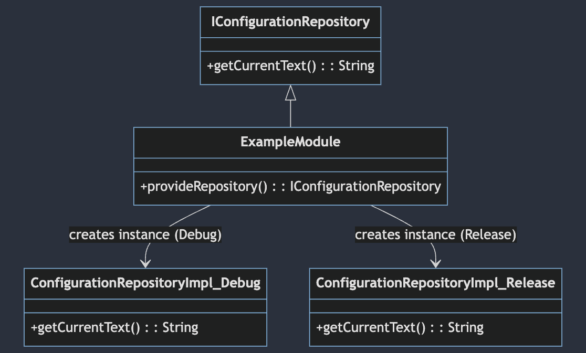

Here is the translated version:

# Dynamic Configuration in Android

This project demonstrates an essential technique for dynamically loading code based on the development environment (debug/release) in an Android application. The implementation is carried out using Dagger, a widely used dependency injection framework in Android development.

# Diagram




## Project Structure

- **`com.david.hackro.di.magic.trick.one`**: Contains the interface `IConfigurationRepository`, defining the contract to retrieve the current text.
- **`com.david.hackro.di.magic.trick.one.di`**: This package is home to the Dagger module `ExampleModule`, providing the concrete implementation of `IConfigurationRepository` based on the development environment.

## Logic and Consistency in Packages

**Consistency in package names is crucial for Dagger's proper functioning**. This ensures that, during dependency injection, Dagger can effectively identify classes and modules corresponding to the execution context.

For example, the class `ExampleModule` in the package `com.david.hackro.di.magic.trick.one.di` provides the concrete implementation of `IConfigurationRepository`. When in the development environment, Dagger searches for this implementation within the same package. Consistency in structure guarantees that Dagger finds the correct implementation without conflicts.

## Code in Debug

Within the package `com.david.hackro.di.magic.trick.one.configuration`, we find the specific implementation for the debugging environment (`Debug`). Despite sharing the same class name (`ConfigurationRepositoryImpl`), there is no conflict because they are contained in different packages.

```kotlin
class ConfigurationRepositoryImpl @Inject constructor() : IConfigurationRepository {
    override fun getCurrentText(): String {
        return "Debug"
    }
}
```

## Code in Release

In the same package `com.david.hackro.di.magic.trick.one.configuration`, there is another specific implementation for the release environment (`Release`). Although both implementations share the same class name, Dagger handles them without conflict by considering the package context.

```kotlin
class ConfigurationRepositoryImpl @Inject constructor() : IConfigurationRepository {
    override fun getCurrentText(): String {
        return "Release"
    }
}
```

## Potential Uses

### Enhanced Unit Testing Environment

Dynamically adjusts the configuration of the unit testing environment to use specific mocks or optimized settings for tests.

### Experimental Feature Control

Enables or disables experimental features of the application based on the environment, facilitating the management of features still in development.

### Developer Interface Customization

Allows developers to customize the user interface in the debugging environment to facilitate inspection and debugging.

## Adaptable to Different Flavors

This approach can be easily adapted to different flavors of the application. By defining specific configurations for each flavor, greater flexibility is achieved in customizing behavior based on different development or deployment contexts.

If you have further questions or need more assistance, feel free to ask. Happy development!
